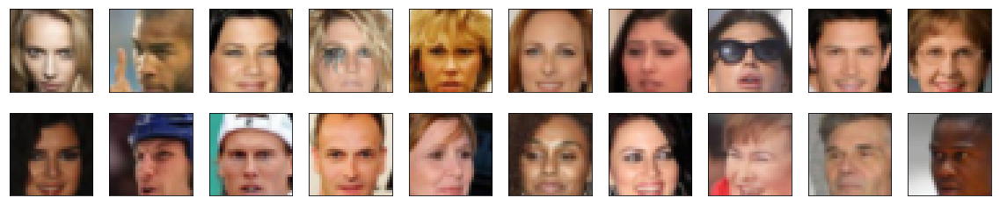
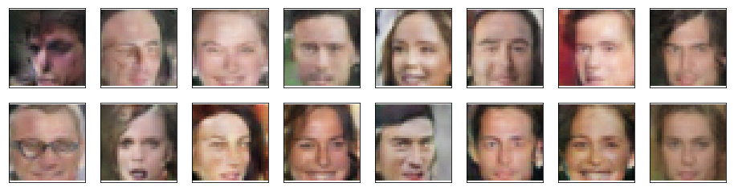

# Face Generation

This repository contains the essential code for the paper [_Unsupervised representation learning with deep convolutional generative adversarial networks_](https://arxiv.org/pdf/1511.06434.pdf) (ICLR 2016).
According to the article:
> In this work we hope to help bridge the gap between the success of CNNs for supervised learning and unsupervised learning. We introduce a class of CNNs called deep convolutional generative adversarial networks (DCGANs), that have certain architectural constraints, and demonstrate that they are a strong candidate for unsupervised learning.

## Requirements:
* Python 3+
* PyTorch 0.4.1+

## Overview
In the [notebook](./face_generation.ipynb) it is demonstrated the applicability of **`DCGAN`** as image generator. I define and train a **`DCGAN`** on a dataset of faces. The goal is to get a generator network that generates new images of faces that look as realistic as possible!
The project is broken down into
* Data loading
* GAN definition
* Training.

### Data loading
The data to train your adversarial networks is taken from [_CelebFaces Attributes Dataset (CelebA)_](http://mmlab.ie.cuhk.edu.hk/projects/CelebA.html). The dataset is quite complex than MNIST or SVHN. Consequently, the neural network should be deeper and trained for a longer time to get good results (preferably on GPU). The **`CelebA`** dataset contains over 200k celebrity images with annotations. Since we're going to generate faces, we won't need the annotations. The images are color with 3 color channels (RGB).

### Pre-processed Data
Since the project's main focus is on building the GANs for face generation, data were pre-processed: each of the CelebA images has been cropped to remove parts of the image that don't include a face. Besides, the images were resized down to 64x64x3 NumPy images. Some sample data is shown below.

The pre-processed data can be downloaded by clicking [here](https://s3.amazonaws.com/video.udacity-data.com/topher/2018/November/5be7eb6f_processed-celeba-small/processed-celeba-small.zip)
This is a zip file that needs to be extracted in the home directory of this notebook for further loading and processing.

Because we are going to use a `tanh` activated function in a `generator`, the output's pixel values will be in a range from -1 to 1, and so, we need to re-scale our training images to a range of -1 to 1. (Right now, they are in a range from 0-1). It makes a discriminator's input and the generator's output consistent.

### Model definition
A GAN is comprised of two adversarial networks, a discriminator and a generator.

#### Discriminator
This is a convolutional classifier only without any max-pooling layers. To deal with this complex data, a deep network with batch normalization is used.

#### Generator
The generator should upsample an input and generate a new image of the same size as our training data 32x32x3. This should be mostly transposed convolutional layers with normalization applied to the outputs.

#### Network weights Initialization
To help models to converge, the weights of the convolutional and linear layers should be initialized according to the original DCGAN [paper](https://arxiv.org/pdf/1511.06434.pdf). It says:
> All weights were initialized from a zero-centered Normal distribution with a standard deviation of 0.02.

### Discriminator and Generator Losses
Loss is calculated for both types of adversarial networks.

#### Discriminator Losses
For the discriminator, the total loss is the sum of the losses for real and fake images, `d_loss = d_real_loss + d_fake_loss`.

#### Generator Loss
The generator loss will look similar only with flipped labels. The generator's goal is to get the discriminator to think its generated images are real.

Cross entropy loss is used for both networks (but least square errors can also be just fine). Besides, it is recommended to use smoothing for discriminator's real loss.

### Results
The result in the format of generated faces is at the end of the [notebook](./face_generation.ipynb). Generated samples look fairly realistic.

#### Results interpretation and further improvements:
* The dataset is biased because there are only pretty celebrities and mostly white people. Thus, people from different races and nationalities should be included to have a robust model.
* Model size can be larger. Currently, only four convolutional and transposed convolutional layers are used. For instance, ResNet module can add value and a larger number of convolutional layers, dropouts, etc.
* Image size can be taken as 64x64 instead of 32x32.
* Data augmentations like brightness, rotation, etc. could add value.
* Regarding optimization, the outputs with different batch sizes look a bit different and if it is large (128 and more) - the quality of generated images is deteriorated. On the other hand, if it is too low, the gradients are volatile.